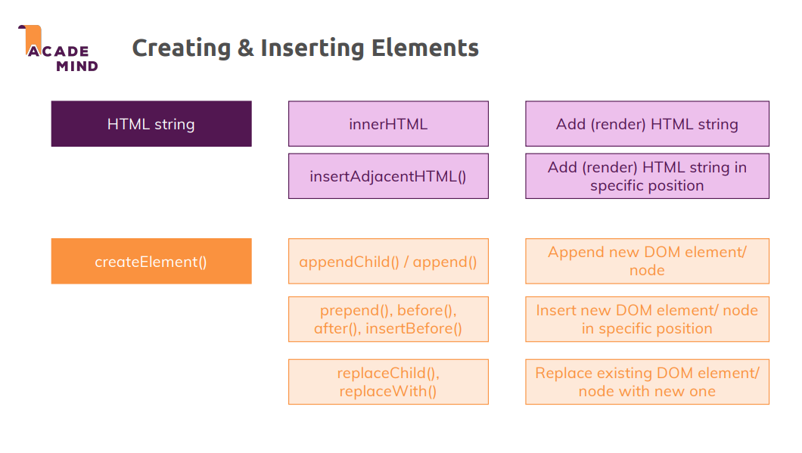

# 섹션 7 JavaScript에서 Dom으로 작업하기

~~~
const list = document.querySelector('ul');
undefined
list.firstElementChild.replaceWith(newLi);
VM131:1 Uncaught ReferenceError: newLi is not defined
    at <anonymous>:1:36
(익명) @ VM131:1
const newLi = document.createElement('li');
undefined
list.firstElementChild.replaceWith(newLi);
undefined
const secondLi = list.children[1];
undefined
newLi.textContent = 'Item 4';
'Item 4'
secondLi.insertAdjacentElement('afterend',newLi);
<li>​…​</li>​
const newLi2 = newLi.cloneNode(true);
undefined
list.append(newLi, newLi2);
undefined
~~~

`cloneNode(true);` 를 이용하면 노드 복사가 가능하다.

`getElementsBy***()`메서드를 이용하면 예전에 쿼리한 아이템이 바뀌면 같이 바뀐다.
